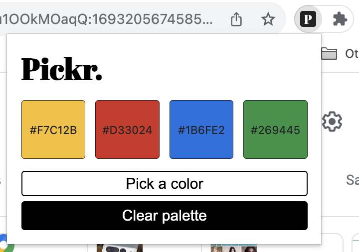

# Pickr — Eye Dropper Chrome Extension Tool

Pickr is a minimalistic Chrome Extension tool that I built to experiment with designing my own Chrome Extensions using [Manifest V3](https://developer.chrome.com/docs/extensions/mv3/intro/). Like most eye dropper tools, Pickr can grab the colors from almost any web page*. Pickr also saves your recently used colors in local memory so you can revisit your palette later (if need be).

(*) As of August 2023, Pickr does not support access on the following pages:
* Chrome pages (settings, web store, extensions page, etc.)
* Behance.net
* any local pages

