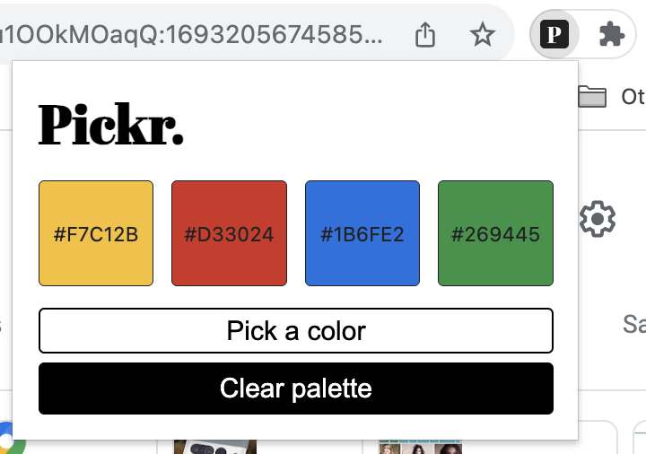

# Pickr — Eye Dropper Chrome Extension Tool

Pickr is a minimalistic Chrome Extension tool that I built to experiment with designing my own Chrome Extensions using [Manifest V3](https://developer.chrome.com/docs/extensions/mv3/intro/). Like most eye dropper tools, Pickr can grab the colors from almost any web page*. Pickr also saves your recently used colors in local memory so you can revisit your palette later (if need be).

(*) As of August 2023, Pickr does not support access on the following pages:
* Chrome pages (settings, web store, extensions page, etc.)
* Behance.net
* Any local pages

### How to Use?
Thanks for taking interest! You won't find Pickr in the Chrome Web Store. I've decided (for now) it doesn't need to be in there as it's not a heavily developed extension. If you'd like to use it please follow the instructions below:
1. Download this repository as a `.zip` file
2. Extract and place the entire Pickr repository folder somewhere safe (*I suggest the Documents or make a Developer directory - just somewhere you wont accidentally delete it*)
3. Open Chrome web browser. In the right-hand menu, navigate down to **Extensions** then click on **Manage Extensions**.

4. Ensure that you are in "Developer Mode" by clicking the toggle in the top corner so it becomes blue.
5. Click on **Load unpacked** and navigate into the root of the Pickr folder. Press **Select**.
6. You're done! Now you can use the extension by clicking on the puzzle logo in the address bar and selecting **Pickr**.

### Quick Fix(es)
* If for any reason the eye dropper tool does not appear when you select **Pick a color**, refresh the page first before using the extension. If the problem persists then you can let me know by [creating an issue](https://docs.github.com/en/issues/tracking-your-work-with-issues/creating-an-issue).